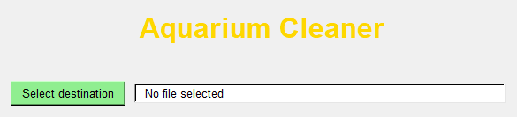

#  
---
Cleans your desktop for you, so you can be as dirty as you want to be.

# 🌟 Highlights
---
- Auto move desktop files
- Custom destination folder
- Auto sort types into folders
- Auto custom runtime 

# ℹ️ Overview
---
I just like all people love to throw a file on my desktop just to use it once and forget all about cleaning it. which is why inspired by arc deleting your tabs every day i decided to make this software that removes your dekstop files over to another folder of your choosing, while also sorting the type of file.

# 🚀 Usage
---

select which drive you want your dekstop files to be moved into, then select when you want it to run.

 If you want to create exception files that will will not be moved you will have to add it to the EXCEPTIONS in the config file (C:\Users\YOURUSER\AppData\Local\AquariumCleaner)

>[EXCEPTIONS]
name = Desktop.ini, Codes

# ⬇️ Installation
---

Unzip 
> AquariumDesktop.zip

run 
> AquariumDesktop.exe

set your settings and your are done.
